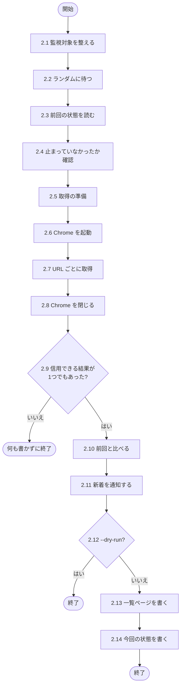
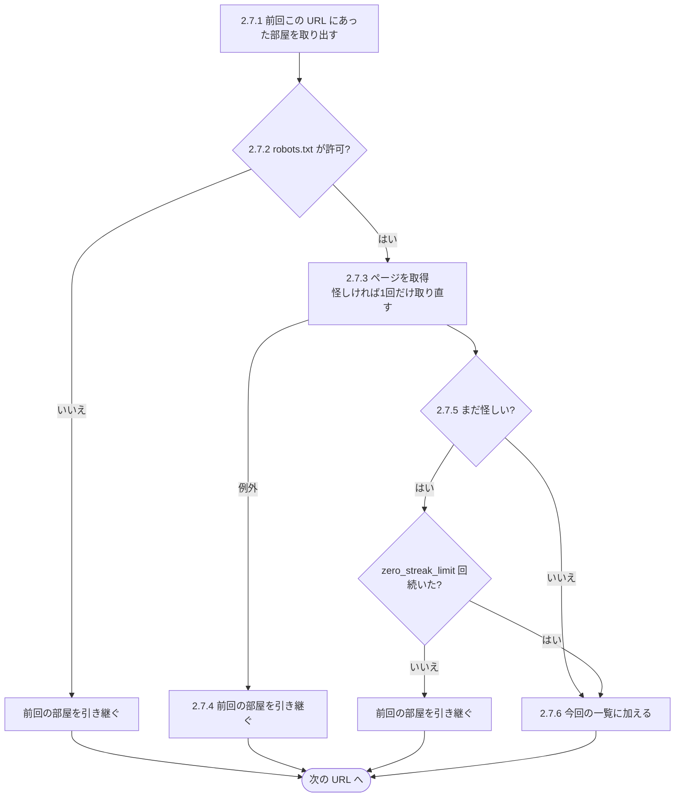

# ur_monitor.php の処理の流れ

`ur_monitor.php` と並べて読むための資料です。**処理の順番だけ**を書いています。
設定項目・動作の仕様・そうしている理由は、ほかの資料にあります（一覧は[資料の入口](https://tama-create.github.io/ur-monitor/)）。

**コードとの対応**：コードの中に `// [FLOW 2.3]` のような印があり、この資料の見出し番号と一致します。
問題が起きたら、ログやコードの位置から番号をたどってください（エディタや GitHub で `FLOW 2.3` を検索すると、
コードの該当箇所と、その処理を担当する関数の説明の両方が見つかります）。
行番号はコードを直すたびにずれるため、番号で対応させています。**処理を変えたら、同じ番号の記述も直してください。**

## 1. 起動（エントリーポイント）

### 1.1 設定を読む

- `load_config`：`config.json` を読み、環境変数 `SLACK_WEBHOOK_URL` があれば Slack の送り先を上書きする

### 1.2 モードを選ぶ

| 引数 | 行き先 |
|---|---|
| `--setup` | 4. |
| `--seed-state` | 3. |
| `--check-robots` | 5. |
| 上記以外（`--dry-run` を含む） | 2. |

### 1.3 想定外の例外で止める

- どこで例外が起きても `monitor.log` に残し、終了コード1で終わる

## 2. 通常の監視（`run_monitor`）

### 2.1 監視対象を整える

- `normalize_groups` で設定をグループの一覧に、`group_url_map` で「URL → グループ」の表にする
- 監視対象が無ければ終了コード1

### 2.2 ランダムに待つ

- 0〜`jitter_max_seconds` 秒待つ（`--dry-run` では待たない）

### 2.3 前回の状態を読む

- `load_state`：保管先があれば保管先から、無ければ `state.json` から読む
- 読めなければ終了コード1

### 2.4 止まっていなかったか確認する

- `warn_if_stale`：前回の実行から `stale_warning_hours` 以上空いていれば Slack に警告する（`--dry-run` では行わない）

### 2.5 取得の準備をする

- 前回の部屋の URL、URL ごとの連続回数（`zero_streak`）、`zero_streak_limit`、`shrink_guard_ratio` を読む

### 2.6 Chrome を起動する

- `create_browser`：1回だけ起動し、すべての URL で使い回す

### 2.7 URL ごとに取得する

2本目以降は3秒あけてから、2.7.1〜2.7.6 を URL の数だけ繰り返します。

#### 2.7.1 前回この URL にあった部屋を取り出す

- 前回の状態から、この URL で取れていた部屋だけを取り出しておく

#### 2.7.2 robots.txt を確かめる

- `check_robots_txt` が拒否したら、前回の部屋を引き継いで次の URL へ

#### 2.7.3 ページを取得する

- `scrape_url` でページを開き、部屋を取り出す
- `untrusted_result_reason` が「怪しい」と判定したら、5秒待って1回だけ取り直す

#### 2.7.4 取得に失敗したら引き継ぐ

- 取得中に例外が起きたら、前回の部屋を引き継いで次の URL へ

#### 2.7.5 怪しい結果が続くか数える

- 取り直しても怪しければ、連続回数を1増やす
- `zero_streak_limit` 回に届かなければ、前回の部屋を引き継いで次の URL へ
- 届いたら、今回の結果を受け入れる

#### 2.7.6 部屋を今回の一覧に加える

- この URL の連続回数を消す
- 部屋を今回の一覧に加える。同じ部屋が既にあれば、先に入ったほう（上のグループ）を残す

### 2.8 Chrome を閉じる

- `close_browser_safely`：途中で例外が起きても閉じる

### 2.9 信用できる結果が無ければ終わる

- 信用できる結果が1つも無く、今回の一覧も空なら、何も書かずに終わる

### 2.10 前回と比べる

- 今回の件数をログに出し、新着（前回に無い部屋）と消えた部屋を出す

### 2.11 新着を通知する

- `room_notifies` で通知すべき新着を選び、`notify_watch` で Slack へ1通にまとめて送る（`--dry-run` では送らない）
- 消えた部屋の件数をログに出す

### 2.12 --dry-run ならここで終わる

### 2.13 一覧ページを書く

- `save_html`：`templates/list.html` と `templates/list.css` から一覧ページを作って書き出す
- 書けなければ終了コード1

### 2.14 今回の状態を書く

- `save_state`：部屋の一覧・連続回数・実行時刻を書き出す
- 書けなければ終了コード1

## 3. 保管先に前回状態を置く（`--seed-state`・`run_seed_state`）

### 3.1 保管先の設定を確かめる

- `STORE_URL` / `STORE_TOKEN` が無ければ終了コード1

### 3.2 置く状態を用意する

- 手元に `state.json` があればその中身を、無ければ空の状態を用意する

### 3.3 上書きしないか確かめる

- 保管先に既に状態があれば終了コード1

### 3.4 保管先へ置く

- 保管先へ書き込む。書けなければ終了コード1

## 4. セレクター調整（`--setup`・`run_setup`）

### 4.1 先頭の監視 URL を選ぶ

- 監視対象が無ければ終了コード1

### 4.2 画面ありで開いてファイルを保存する

- `scrape_rooms`：画面ありの Chrome で開き、スクリーンショットと `debug_page.html` を保存する

### 4.3 結果を表示する

- 取れた件数と先頭5件を表示する。0件なら、セレクターを直す手順を表示する

## 5. robots.txt の確認（`--check-robots`）

### 5.1 監視 URL を読む

- 監視対象が無ければ終了コード1

### 5.2 すべての URL を確かめる

- `check_robots_txt` で1本ずつ確かめ、1件でも拒否されていれば終了コード1
