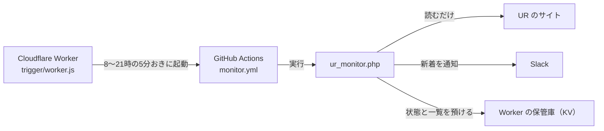
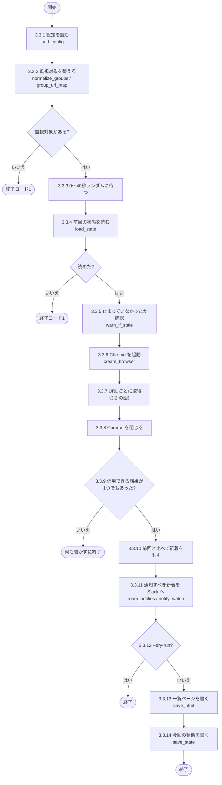
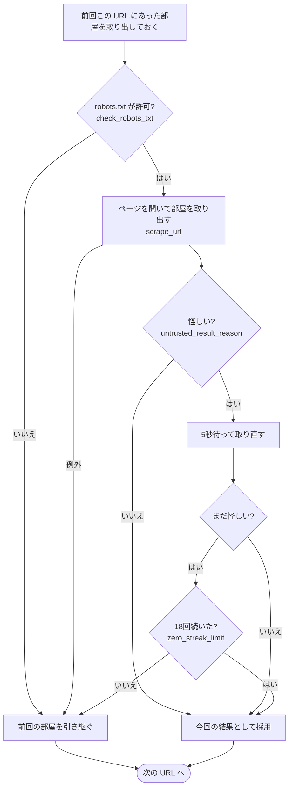

# ur_monitor.php の処理の流れ

`ur_monitor.php` が何をどの順番で行うかをまとめた資料です。コードを読まずに全体を把握するためのものです。
処理を変えたら、この資料も合わせて直してください。

- [1. 全体の中での位置づけ](#1-全体の中での位置づけ)
- [2. 起動のしかた](#2-起動のしかた)
- [3. 通常の監視](#3-通常の監視)
- [4. ほかのモード](#4-ほかのモード)
- [5. 入力と出力](#5-入力と出力)

## 1. 全体の中での位置づけ

## 2. 起動のしかた

| コマンド | 何をするか | 担当する関数 |
|---|---|---|
| `php ur_monitor.php` | 通常の監視（本番） | `run_monitor()` |
| `php ur_monitor.php --dry-run` | 取得と差分だけ。通知・書き込み・待機をしない（開発用） | `run_monitor()` |
| `php ur_monitor.php --seed-state` | 保管先に前回状態を置く（保管先を作った直後に1回だけ） | `run_seed_state()` |
| `php ur_monitor.php --setup` | 画面ありで開き、セレクター調整用のファイルを保存する | `run_setup()` |
| `php ur_monitor.php --check-robots` | robots.txt の確認だけ。拒否が1件でもあれば終了コード1 | （エントリーポイント） |

## 3. 通常の監視

### 3.1 フローチャート

図の中の番号は、3.3 の手順の番号です。

### 3.2 URL ごとの取得（3.3.7 の中身）

### 3.3 手順の詳細

#### 3.3.1 設定を読む（`load_config`）

- `config.json` を読む。無ければ終了コード1
- 環境変数 `SLACK_WEBHOOK_URL` があれば、Slack の送り先をそれで上書きする

#### 3.3.2 監視対象を整える（`normalize_groups` / `group_url_map`）

- `groups` を「名前・通知するか・間取り・URL」の形にそろえる（旧形式の `search_urls` + `watch` なら1グループにまとめる）
- 「URL → グループ」の対応表を作る。同じ URL が複数のグループにあれば、上のグループを採る
- 監視対象が無ければ終了コード1

#### 3.3.3 ランダムに待つ

- 0〜`jitter_max_seconds` 秒待つ。`--dry-run` では待たない
- Cloudflare からの起動は毎回同じ秒に来るので、規則的な足跡にならないようにする

#### 3.3.4 前回の状態を読む（`load_state`）

- 保管先（`STORE_URL`）があれば `GET /state`、無ければ `state.json`
- 保管先に無い・読めない・壊れている → 終了コード1（空とみなすと全部屋が新着になるため）

#### 3.3.5 止まっていなかったか確認する（`warn_if_stale`）

- 前回の実行から、稼働時間帯（8〜21時）の中だけで空白を数える
- 3時間以上なら Slack に「監視が止まっていました」を送る
- `--dry-run` では行わない

#### 3.3.6 Chrome を1回だけ起動する（`create_browser`）

#### 3.3.7 URL ごとに取得する

2本目以降は3秒あけてから、URL ごとに次を行います。

- (1) 前回この URL で取れていた部屋を取り出しておく（失敗時の引き継ぎ用）
- (2) robots.txt が拒否していれば、前回の部屋を引き継いで次へ
- (3) ページを開いて部屋を取り出す（`scrape_url`）
  - DOM の読み込みを待つ（最長30秒）
  - 部屋の行の件数が1秒間変わらなくなるまで待つ（`wait_for_rooms`、最長20秒）
  - 建物名・部屋名・家賃・間取り・URL を取り出す
- (4) 結果が怪しければ5秒待って1回だけ取り直す。「怪しい」とは次のどちらか
  - 前回部屋があったのに0件
  - 前回5件以上あったのに、前回の0.7倍（`shrink_guard_ratio`）を下回った
- (5) 取得中に例外が起きたら、前回の部屋を引き継いで次へ
- (6) 取り直しても怪しければ、連続回数を1増やす
  - 18回（`zero_streak_limit`）未満なら、前回の部屋を引き継いで次へ（ログに「前回状態を維持」。正常な動作）
  - 18回に達したら、本当にそうなったと判断して今回の結果を受け入れる
- (7) 採用した部屋を今回の一覧に加える。同じ部屋が既にあれば、先に入った（上のグループの）ほうを残す

#### 3.3.8 Chrome を閉じる

- 途中で例外が起きても閉じる

#### 3.3.9 信用できる結果が無ければ終わる

- 信用できる結果が1つも無く、一覧も空なら、何も書かずに終わる（取得失敗を「空室ゼロ」と取り違えないため）

#### 3.3.10 前回と比べる

- 新着 = 今回あって前回に無い部屋
- 消えた = 前回あって今回に無い部屋（ログに件数を出すだけ）

#### 3.3.11 通知すべき新着を Slack へ送る（`room_notifies` / `notify_watch`）

- グループが `notify: true` で、間取りが `madori` のどれかに部分一致すれば通知（`madori` が空なら間取りを問わない）
- 旧形式では `watch` との部分一致、または `notify_all_new` で決める
- グループごとにまとめて1通で送る
- `--dry-run` では送らない

#### 3.3.12 `--dry-run` ならここで終わる

#### 3.3.13 一覧ページを書く（`save_html`）

- 見た目は `templates/list.html` と `templates/list.css`
- 保管先があれば `PUT /list`、無ければ `docs/index.html`（開発用）。失敗したら終了コード1

#### 3.3.14 今回の状態を書く（`save_state`）

- 部屋の一覧・連続回数・実行時刻を、保管先があれば `PUT /state`、無ければ `state.json` へ。失敗したら終了コード1
- 一覧を先に書くのは、状態だけ進んで一覧が古いまま残るのを防ぐため

## 4. ほかのモード

### 4.1 --seed-state（`run_seed_state`）

#### 4.1.1 保管先の設定を確かめる

- `STORE_URL` / `STORE_TOKEN` が無ければ終了コード1

#### 4.1.2 置く状態を用意する

- 手元に `state.json` があればその中身を、無ければ空の状態を用意する
- 空の状態を置いた場合、次の通常実行では、いま出ている部屋がすべて新着として通知される

#### 4.1.3 上書きしないか確かめる

- 保管先に既に状態があれば、上書きしないよう終了コード1

#### 4.1.4 保管先へ置く

- 保管先へ `PUT /state` する

### 4.2 --setup（`run_setup`）

#### 4.2.1 画面ありで開く

- 監視対象の先頭の URL を、画面ありの Chrome で開く

#### 4.2.2 調整用のファイルを保存する

- 描画を待ってから、スクリーンショット（`debug_日時.png`）と HTML（`debug_page.html`）を保存する

#### 4.2.3 結果を表示する

- 取れた件数と先頭5件を表示する。0件なら、セレクターを直す手順を表示する

### 4.3 --check-robots

#### 4.3.1 robots.txt を確認する

- すべての監視 URL について robots.txt を確認する

#### 4.3.2 結果を返す

- 1件でも拒否されていれば終了コード1

## 5. 入力と出力

### 5.1 入力と出力の一覧

| 種類 | もの | 中身 |
|---|---|---|
| 入力 | `config.json` | 監視対象・通知条件・しきい値・セレクター |
| 入力 | 環境変数 `SLACK_WEBHOOK_URL` | Slack の送り先 |
| 入力 | 環境変数 `STORE_URL` / `STORE_TOKEN` | 保管先の URL と合言葉（無ければローカルのファイルを使う） |
| 入力 | `templates/list.html` / `list.css` | 一覧ページの見た目 |
| 出力 | Slack | 新着の通知、停止の警告 |
| 出力 | 保管先の `/state` と `/list` | 前回状態（JSON）と一覧ページ（HTML） |
| 出力 | `monitor.log` | 実行ログ（画面にも同じものを出す） |

### 5.2 終了コード

- 0：正常（前回状態を維持してスキップした場合も含む）
- 1：設定・前回状態・書き込みの異常、または想定外の例外

### 5.3 判断の基準

- 通知を1回逃すより、誤った通知を飛ばすほうが害が大きい
- そのため「怪しい結果は採用しない」「前回状態が分からなければ止まる」を優先している
